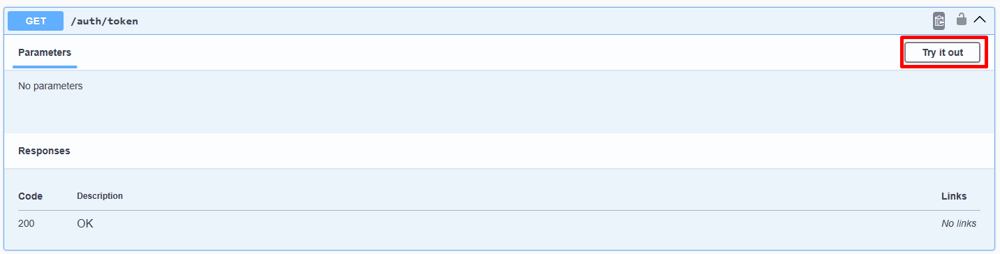
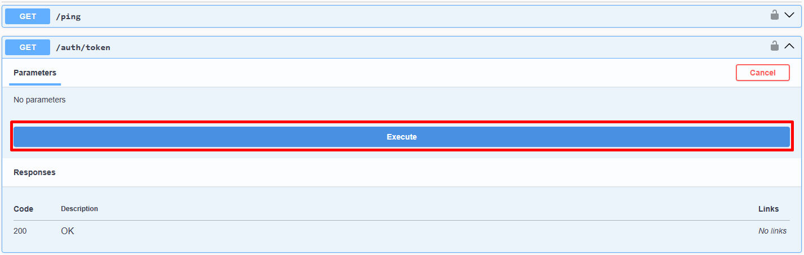
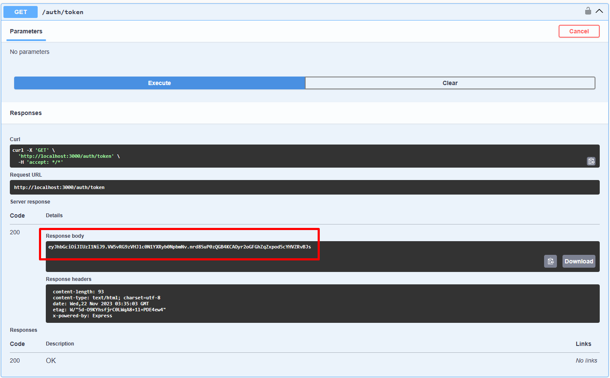
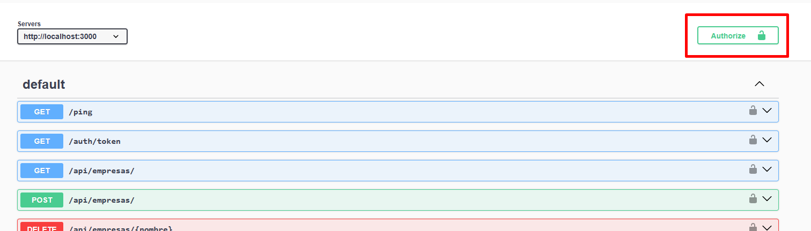
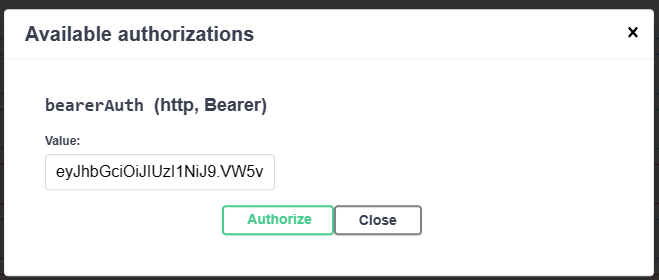
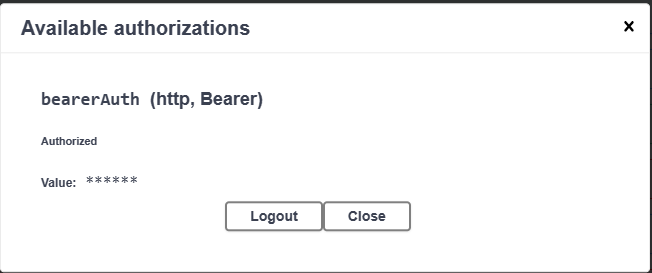
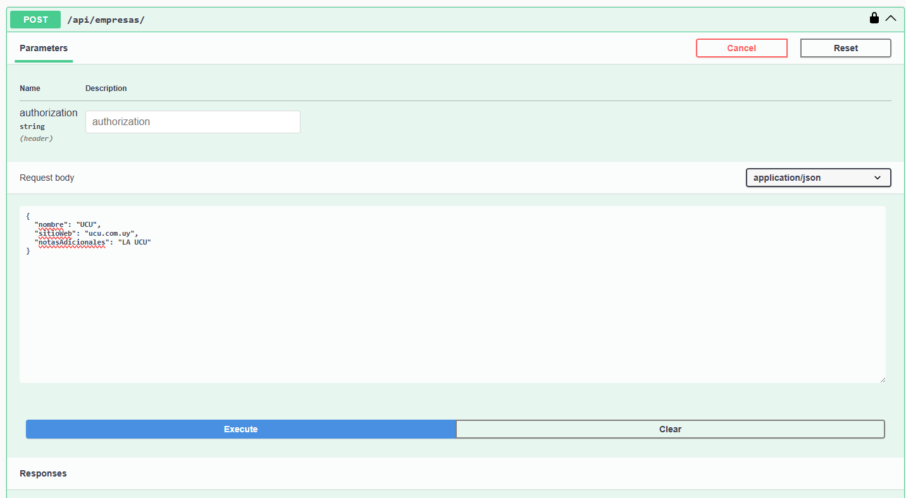
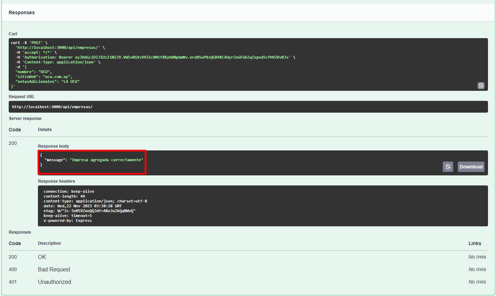
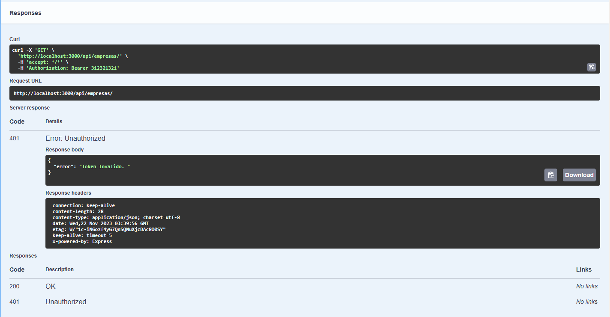

# Parcial 2 - Desarrollo Web y Mobile

## Instrucciones:

1) npm install
2) npm run dev
3) navegar a http://localhost:3000/api-docs/

### Notas: 
#### Esta version del instructivo fue generada con la idea del simulacro del parcial. Los endpoints son distintos pero la idea general es la misma.
#### NO USAR EL PARAMETRO AUTHORIZATION EN LOS ENDPOINTS.
#### PRIMERO USAR EL ENDPOINT [GET] /auth/token y luego con ese token continuar las requests siguientes.

### Instrucciones (Con Visuales)

1) Dar click en Try it out en [GET] /auth/token

2) Dar click en Execute

3) Procurar el JWT

4) Dar click en Authorize

5) Copiar el JWT y dar click en Authorize

6) Usted esta autorizado correctamente:

### Puede proceder a usar la api

Resultado correcto:

Resultado Incorrecto:

